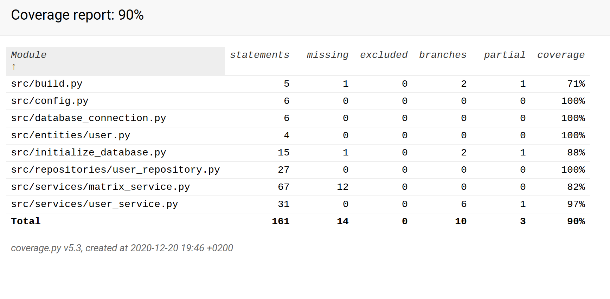

# Testausdokumentti

Ohjelmaa on testattu sekä automatisoiduin yksikkö- ja integraatiotestein unittestilla sekä manuaalisesti tapahtunein järjestelmätason testein.

## Yksikkö- ja integraatiotestaus

### Sovelluslogiikka

Sovelluslogiikasta vastaavaa `UserService`-luokkaa testataan [TestUserService](https://github.com/ohjelmistotekniikka-hy/python-todo-app/blob/master/src/tests/services/todo_service_test.py)-testiluokalla. `UserService`-olio alustetaan, niin että sille injektoidaan riippuvuksiksi repositorio-olio, joka tallentaa tietoa muistiin pysyväistallennuksen sijaan. Tätä varten testissä on käytössä luokka `FakeUserRepository`.

### Repositorio-luokka

Repositorio-luokkaa `UserRepository` testataan ainoastaan testeissä käytössäolevilla tiedostoilla. Tiedostojen nimet on konfiguroitu _.env.test_-tiedostoon. `UserRepository`-luokkaa testataan [TestUserRepository](https://github.com/ohjelmistotekniikka-hy/python-todo-app/blob/master/src/tests/repositories/user_repository_test.py)-testiluokalla.

### Testauskattavuus

Käyttöliittymäkerrosta lukuunottamatta sovelluksen testauksen haarautumakattavuus on 93 %

## Järjestelmätestaus

Sovelluksen järjestelmätestaus on suoritettu manuaalisesti.

### Asennus ja konfigurointi

Sovellus on haettu ja sitä on testattu [käyttöohjeen](./kayttoohje.md) kuvaamalla tavalla 2020-luvun fuksiläppärillä Linux-ympäristössä. Testauksessa on käytetty myös eri konfiguraatioita _.env_-tiedoston kautta.

Sovellusta on testattu sekä tilanteissa, joissa käyttäjät tallettava tiedosto on ollut olemassa ja jossa sitä ei ole ollut jolloin ohjelma on luonut sen itse.

### Toiminnallisuudet
TARKISTA

Kaikki [määrittelydokumentin](https://github.com/mhamaril/ot-harjoitustyo/blob/master/Matriisilaskin/dokumentaatio/Vaativuusmaarittely.md#kirjautuneen-k%C3%A4ytt%C3%A4j%C3%A4n-version-tarjoama-toiminnallisuus) ja käyttöohjeen listaamat toiminnallisuudet on käyty läpi. Kaikkien toiminnallisuuksien yhteydessä on syötekentät yritetty täyttää myös virheellisillä arvoilla kuten tyhjillä.

## Sovellukseen jääneet laatuongelmat
TARKISTA

Sovellus ei anna tällä hetkellä järkeviä virheilmoituksia, seuraavissa tilanteissa:

- Konfiguraation määrittelemiin tiedostoihin ei ole luku/kirjoitusoikeuksia
- SQLite tietokantaa ei ole alustettu, eli `python -m pipenv run build`-komentoa ei ole suoritettu
